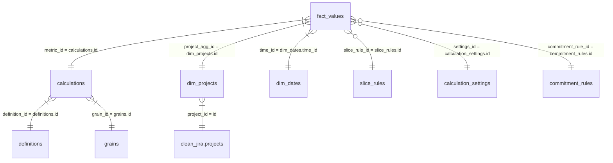

# Process Metrics Platform v2 - Ultimate Metrics Schema & Calculation Guide

Этот документ является полным техническим эталоном для схемы `metrics` и логики расчета всех метрик платформы. Он предназначен для использования инженерами данных, BI-аналитиками и для обучения LLM-агентов генерации SQL-запросов.

---

## 1. Архитектурная концепция

Схема `metrics` реализует паттерн **Generic Long Metric Store**. В отличие от классических витрин, где под каждую метрику создается отдельная колонка или таблица, здесь все данные хранятся в унифицированной таблице фактов.

**Ключевые принципы:**
- **Long Format:** Каждое измерение — это отдельная строка.
- **Single Source of Truth:** Таблица `fact_values` является единственным местом хранения рассчитанных чисел.
- **Dimension-Driven:** Поведение расчетов и интерпретация данных управляются через справочники (`definitions`, `calculations`, `grains`, `units`).
- **Late Binding:** Денормализация (склейка справочников) происходит в представлении `v_facts`, что упрощает BI-слой.

---

## 2. Справочник таблиц схемы `metrics`

Ниже приведено детальное описание каждой таблицы, ее полей и ролей.

### 2.1. Таблица `metrics.fact_values`
Центральная таблица фактов. Хранит все рассчитанные значения.

| Поле | Тип | Описание | Пример значения |
| :--- | :--- | :--- | :--- |
| `id` | `uuid` | Первичный ключ записи. | `cd79d61c-8673...` |
| `metric_id` | `uuid` | FK на `calculations.id`. ЧТО именно мы измерили. | `ff8b1c8b-f94d...` |
| `project_agg_id` | `uuid` | FK на `dim_projects.id`. К какому проекту относится. | `32287b8a-f306...` |
| `time_id` | `int` | FK на `dim_dates.time_id`. Дата факта (YYYYMMDD). | `20260324` |
| `value` | `float8` | Численное значение метрики. | `42.5` |
| `entity_type` | `text` | Тип измеряемого объекта (`sprint`, `issue`, `release`). | `sprint` |
| `entity_id` | `text` | ID объекта (UUID спринта или ключ задачи). | `TWMOB-101` |
| `event_start_at`| `timestamptz`| Время начала (для Lead Time / Cycle Time). | `2026-03-01 10:00:00+00`|
| `event_end_at` | `timestamptz`| Время завершения/закрытия. | `2026-03-05 18:00:00+00`|
| `slice_rule_id` | `uuid` | FK на `slice_rules`. Указывает на правило среза. | `e0f17505-2f7a...` |
| `slice_value` | `text` | Значение измерения (напр. 'Bug', 'Critical'). | `Bug` |
| `commitment_rule_id`| `uuid` | FK на `commitment_rules`. Границы потока. | `f1fb6b6f-5361...` |
| `settings_id` | `uuid` | FK на `calculation_settings`. Настройки расчета. | `50d71737-e9bf...` |
| `context_json` | `jsonb` | Доп. данные (assignee, компоненты, ссылки). | `{"assignee": "Alex"}` |

### 2.2. Таблица `metrics.definitions`
Группы (категории) метрик.

| Поле | Тип | Описание | Пример значения |
| :--- | :--- | :--- | :--- |
| `id` | `uuid` | PK. | `1739697a-1422...` |
| `metric_code` | `text` | Уникальный код группы. | `velocity` |

### 2.3. Таблица `metrics.calculations`
Конкретные алгоритмы расчета внутри групп.

| Поле | Тип | Описание | Пример значения |
| :--- | :--- | :--- | :--- |
| `id` | `uuid` | PK. | `8d693419-c98a...` |
| `definition_id` | `uuid` | FK на `definitions.id`. | `1739697a-1422...` |
| `calc_code` | `text` | Код расчета. | `velocity_planned_sp` |
| `grain_id` | `uuid` | FK на `grains.id`. Уровень гранулярности. | `5eb68a45-0683...` |
| `unit_code` | `text` | Код единицы измерения. | `story_points` |
| `uses_commitment_points`| `bool` | Нужны ли точки входа/выхода на доске. | `false` |

### 2.4. Таблица `metrics.grains` (Уровни детализации)
Определяет, что является одной строкой в контексте сущности.

| Поле | Тип | Описание | Код (grain_code) |
| :--- | :--- | :--- | :--- |
| `id` | `uuid` | PK. | - |
| `grain_code` | `text` | Код уровня. | `issue`, `sprint`, `day` |
| `description` | `text` | Описание смысла. | "One row per issue" |

### 2.5. Таблица `metrics.dim_projects` (Проекты)
| Поле | Тип | Описание |
| :--- | :--- | :--- |
| `id` | `uuid` | PK (используется в `fact_values.project_agg_id`). |
| `project_id` | `uuid` | FK на `clean_jira.projects.id`. |
| `project_key` | `text` | Ключ проекта (напр. 'TWMOB'). |

---

## 3. Реляционная схема (ERD)



---

## 4. Как работает заполнение данных (ETL Flow)

Процесс расчета и загрузки (Dagster + Polars) состоит из следующих этапов:

1.  **Extraction:** Из слоя `clean_jira` вычитываются основные сущности: `issues`, `sprint_changelog`, `status_changelog`.
2.  **Logic Application:**
    - Для **Velocity:** Анализируются моменты старта спринта (Commitment) и момент закрытия.
    - Для **Lead Time:** По `commitment_rules` ищется первый переход в `In Progress` и последний в `Done`.
    - Для **CFD/Backlog:** Строится ежедневная матрица состояний.
3.  **Slicing (Срезы):** Если для метрики включены правила в `slice_rules`, расчет повторяется для каждой группы (например, отдельно по типам задач).
4.  **Loading:** Данные "схлопываются" в формат фактов. Старые значения для того же `metric_id + project + time + entity_id + slice` удаляются (upsert логика), и вставляются новые.

---

## 5. Справочные значения измерений (на основе БД)

### 5.1. Доступные метрики (Metric Codes)
- `velocity` — Эффективность планирования и поставки в спринтах.
- `lead_time` — Скорость прохождения задач.
- `throughput` — Пропускная способность.
- `cfd` — Накопительная диаграмма потока.
- `backlog_growth` — Здоровье и динамика бэклога.
- `ttm` — Time to Market (от идеи до релиза).
- `aging` — Старение активных задач.
- `flow_efficiency` — Эффективность потока.
- `sprint_health` — Операционные показатели спринта (Scope Creep, Burndown).
- `quality` — Качество (баги, возвраты).

### 5.2. Единицы измерения (Units)
- `story_points` (SP)
- `issues` (штуки)
- `days` (дни)
- `hours` (часы)
- `percent` (%)
- `ratio` (коэффициент)

---

## 6. Детальный каталог метрик (Calculation Catalog)

Ниже приведена расширенная логика каждого расчета.

### 6.1. Группа: Velocity
**Цель:** Оценка предсказуемости команды.

- **`velocity_planned_sp`**
  - *Суть:* Что команда обещала.
  - *Расчет:* Сумма Story Points всех задач, которые были привязаны к спринту на момент его официального старта (нажатие кнопки "Start" в Jira) + грайс-период (для учета мелких правок в первые минуты).
- **`velocity_completed_sp`**
  - *Суть:* Что команда реально сделала.
  - *Расчет:* Сумма Story Points задач, которые находятся в спринте на момент его завершения и перешли в категорию статуса "Done" в промежутке между датой старта и датой фактического завершения спринта.
- **`velocity_planned_count` / `velocity_completed_count`**
  - Аналогично вышеописанному, но в штуках (COUNT) задач.

### 6.2. Группа: Sprint Health (Операционка)
**Цель:** Понять, "горит" ли текущий спринт.

- **`sprint_burndown_remaining_sp`**
  - *Суть:* Ежедневный остаток работ.
  - *Расчет:* `Planned_SP_at_Start + Scope_Creep_SP - Completed_SP_at_Day_N`. Считается для каждой даты жизни спринта.
- **`activation_velocity_pct`**
  - *Суть:* Как быстро команда приступает к работе.
  - *Расчет:* `% Story Points` от коммитмента, которые вышли из статуса "To Do" в любой другой статус. Если на 3-й день спринта значение 10% — это аномалия (медленный старт).
- **`sprint_added_sp_sum` (Scope Creep)**
  - *Суть:* Неплановые работы.
  - *Расчет:* Сумма SP задач, у которых в `sprint_changelog` действие `added` произошло ПОСЛЕ старта спринта.
- **`sprint_spillover_count`**
  - *Суть:* "Хвосты".
  - *Расчет:* Количество задач, которые присутствуют в текущем спринте и перешли в него из предыдущего (или присутствуют в >1 спринте одновременно).

### 6.3. Группа: Lead Time & Flow Efficiency
**Цель:** Поиск скрытых потерь в процессе.

- **`lead_time_days`**
  - *Суть:* Полное время жизни задачи.
  - *Расчет:* `Date_Done - Date_Commitment_Start`. Точки берутся из `commitment_rules` (обычно In Progress -> Done).
- **`flow_active_days` / `flow_wait_days`**
  - *Суть:* Разделение времени на работу и ожидание.
  - *Расчет:* По `status_changelog` суммируется время нахождения в статусах, помеченных как "активные" или "ожидающие" в настройках доски.
- **`flow_efficiency_pct`**
  - *Суть:* Коэффициент полезного действия.
  - *Расчет:* `Active_Days / (Active_Days + Wait_Days) * 100`. Значение ниже 15-20% говорит о том, что задача большую часть времени стоит в очередях.

### 6.4. Группа: Aging & Stale (Риски)
**Цель:** Обнаружение "зависших" тикетов.

- **`aging_days`**
  - *Суть:* Возраст текущего WIP (Work in Progress).
  - *Расчет:* Для незакрытых задач: `Current_Date - Date_Commitment_Start`.
- **`stale_days`**
  - *Суть:* Отсутствие активности.
  - *Расчет:* `Current_Date - Date_Last_Update`. Если задача висит 5 дней в одном статусе без комментов и правок — она "протухла".

### 6.5. Группа: Backlog & Throughput
**Цель:** Оценка долгосрочной динамики.

- **`backlog_size`**
  - *Суть:* Общий объем работы "на полке".
  - *Расчет:* COUNT(*) задач в проекте, которые не в Done и не отменены. Делается ежедневный снимок.
- **`backlog_net_growth`**
  - *Суть:* Скорость накопления техдолга.
  - *Расчет:* `Created_Today - Resolved_Today`. Если значение стабильно положительное — бэклог бесконтрольно растет.
- **`throughput_count`**
  - *Суть:* Производительность.
  - *Расчет:* Количество закрытых задач за период (обычно агрегируется по неделям).

---

## 7. Примеры SQL-запросов для обучения Gemini

Ниже приведены паттерны, которые должен использовать агент при генерации SQL.

### Шаблон 1: Velocity за 5 спринтов
```sql
SELECT
    dt.full_date as start_date,
    dp.project_key,
    fv.entity_id as sprint_id,
    MAX(CASE WHEN c.calc_code = 'velocity_planned_sp' THEN fv.value END) as planned_sp,
    MAX(CASE WHEN c.calc_code = 'velocity_completed_sp' THEN fv.value END) as completed_sp
FROM metrics.fact_values fv
JOIN metrics.calculations c ON fv.metric_id = c.id
JOIN metrics.dim_projects dp ON fv.project_agg_id = dp.id
JOIN metrics.dim_dates dt ON fv.time_id = dt.time_id
WHERE c.calc_code IN ('velocity_planned_sp', 'velocity_completed_sp')
  AND fv.slice_rule_id IS NULL -- Общие данные без срезов
  AND dp.project_key = {{project_key}}
GROUP BY 1, 2, 3
ORDER BY 1 DESC
LIMIT 5;
```

### Шаблон 2: Список "стареющих" задач (Aging)
```sql
SELECT
    fv.entity_id as issue_key,
    fv.value as age_days,
    fv.slice_value as current_status,
    fv.context_json->>'assignee' as assignee
FROM metrics.v_facts fv
WHERE fv.calc_code = 'work_item_age_days'
  AND fv.project_key = {{project_key}}
  AND fv.value > 7 -- Старше недели
ORDER BY fv.value DESC;
```

---

## 8. Имена Срезов (Slice Rules)

В БД заведено стандартное правило:
- **`By Issue Type`** (rule_name): Нарезает метрику по типам задач из `clean_jira.issue_types`.
  - Источник: `clean_jira.issue_types.name`.
  - Используется для: Lead Time, Velocity, Throughput.

При использовании в SQL:
```sql
WHERE slice_rule_name = 'By Issue Type' AND slice_value = 'Bug'
```

---

## 9. Настройки расчетов (Calculation Settings)

Таблица `calculation_settings` хранит переопределения логики.
- **`issue_type_filter`** (settings_type): JSON вида `{"include": ["Epic"]}`. Если такой настройки нет, расчет идет по всем типам.
- Эти настройки автоматически подтягиваются в `v_facts` как `calc_settings_json`.

---

Этот документ является исчерпывающим описанием системы. Любое отклонение от этих имен таблиц или кодов метрик является ошибкой.
